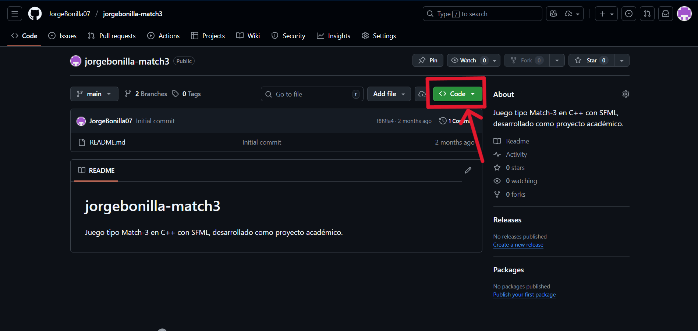
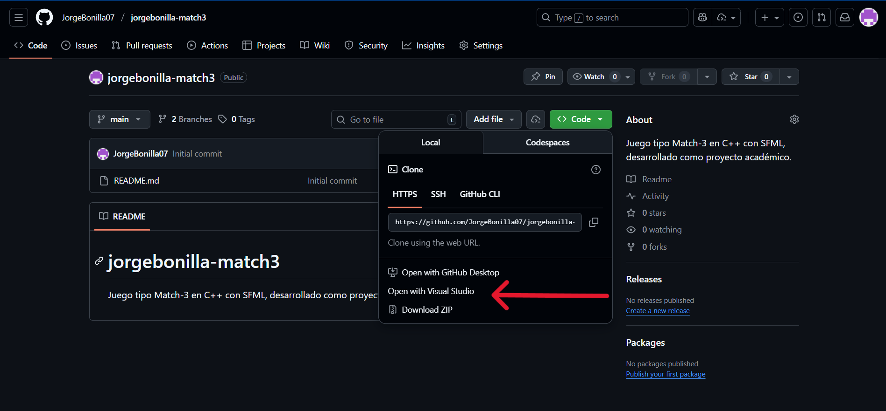
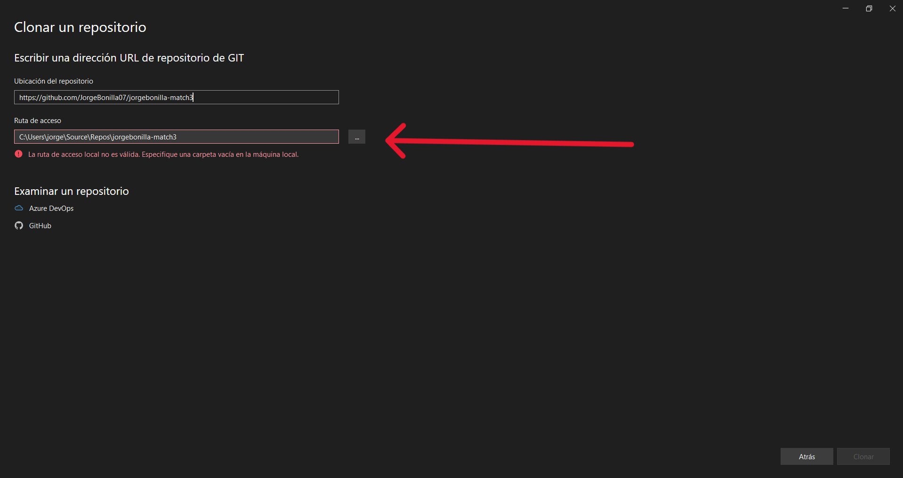
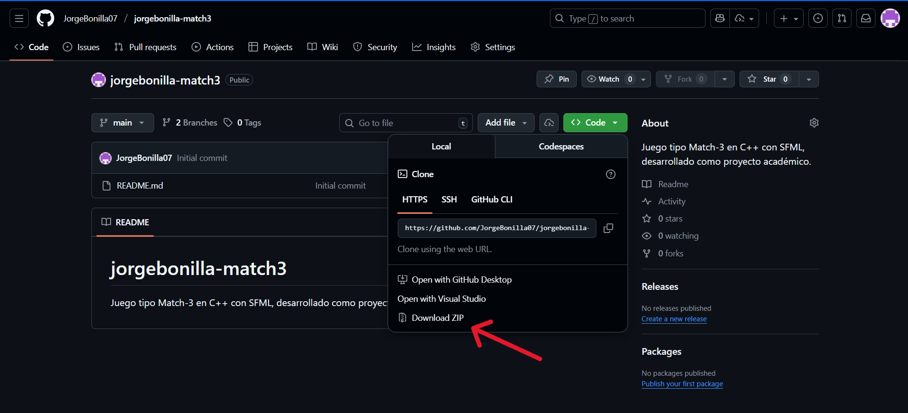

# 🌸 Petal Match 

Juego tipo *Match 3* desarrollado en **C++** usando **SFML-2.6.2** creado como proyecto academico
Creado en *Visual Studio 2022*.

---

## 🧰 Requisitos
- Windows 10 o superior
- Visual Studio 2022
- Compilador compatible con **C++17**
- SFML Graphics 2.6.2
  En el siguiente link encontrara una tutorial para instalarlo:
 [Link de instalacion](https://www.youtube.com/watch?v=4ftI3qhFlIs)

 ---

## 🧭 Instalacion y compilacion 

### Opcion 1 - Clonar el repositorio desde GitHub

1.Oprima el boton "Code" verde

2.Seguidamente seleccione la opcion "Abrir con Visual Studio"

3.Seguidamente se abrira Visual Studio en su computador con el enlace del repositorio listo, luego de esto, tendra que seleccionar la ubicacion en la que desea instalar el repositorio

4.Visual Studio abrirá automáticamente la solución (`.sln`). 

6.Compila y ejecuta el proyecto con **Ctrl + F5** o el botón **Iniciar sin depurar** que se encuentra en la parte superior.

---

### 🔹 Opción 2 — Instalar manualmente
1. Descarga el repositorio como `.zip` desde GitHub. 

2. Extrae los archivos.  
3. Abre el archivo `PROYECTO_JORGE_BONILLA.sln` con Visual Studio 2022.  
4. Compila y ejecuta el proyecto.

## 📁 Estructura del proyecto
-Archivos de encabezado (.h)

-Archivos de origen (.cpp)

-assets/ → Imágenes y fuentes

-SFML/ → Librerías y DLLs incluidas

## 👤 Autor
**Jorge Bonilla**

@JorgeBonilla07

jorge.bonilla.araya@est.una.ac.cr

Proyecto Programacion I - 2025

